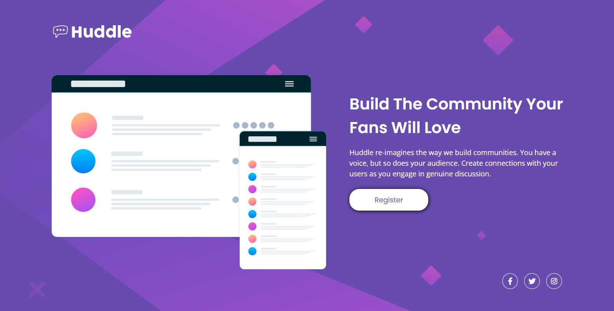

# Frontend Mentor - Huddle landing page with single introductory section solution

## Tabela de conteudo

- [Visao geral](#visao-geral)
  - [O desafio](#o-desafio)
  - [Screenshot](#screenshot)
  - [Links](#links)
  - [Built with](#built-with)
  

## Visao geral

### O desafio

Esses são os designs do desafio, tanto a versao desktop com seus active-states, como a versao mobile.

`Desktop`

`Mobile`

`Active-States`

### Screenshot

Minha solução para o projeto

### Links

- Live Site URL: [https://deividson-hsilva.github.io/huddle-landing-page-challenge/]

### Built with

- HTML5 
- CSS 
- Flexbox

